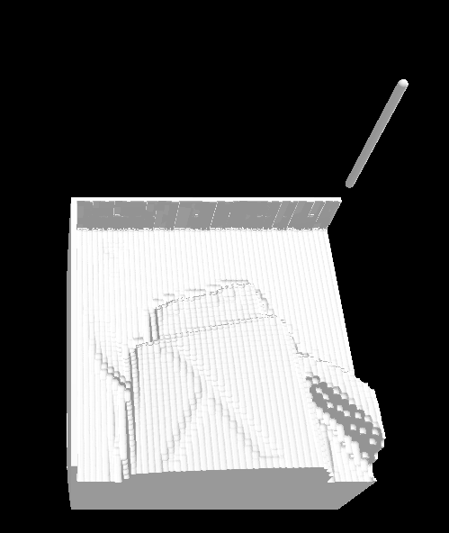

# gcode raymarching simulator

This is an experiment to test the viability of visualizing material removal
in the context of a 2.5 cnc milling machine.



This approach could probably be used for FDM 3d printing as well, but that
is not my primary focus at this time.

## how does it work?

### rough history

The main approach here is called "raymarching signed distance fields" and derives from a technique
popularized in the 4k demo scene by [Iñigo Quílez](http://www.iquilezles.org/).  The foundation of
ray marching comes from a technique called "Sphere Marching"

### nitty gritty

We're not going to get into the intimate details of raymarching here, but more into the way this
experiment is tied together.  If you want to learn more see the [further reading](#further-reading) section below.

To start, we have a quad that we fill the entire screen with.  A vertex shader that does next to nothing
is provided to send geometry to the fragment shader.  The fragment shader is where all of the work is done.

There is a timer that moves a `cutterPosition` around the scene and a couple of ndarrays, which can be thought of as depth textures.

#### ndarray 1

refered to by the name `tool`

The first ndarray is precomputed to be the shape of the end of the cutting tool in question this is essentially
a rasterization operation that only needs to be computed once as we are going to apply it to the second ndarray
as the tool moves around in the scene.

#### ndarray 2

refered to by `depthTexture`

This ndarray is as big as possible (for now), and it represents the history of the tool location.  This history
is achieved by applying `tool` to the larger array every time the `cutterPosition` moves.  If any dexel in the
`tool` texture + the `cutterPosition.y` is "deeper" than what is represented in the `depthTexture` then the dexel
is applied to the texture.

i.e. `depthTexture[x][y] = max(depthTexture[x][z], tool[x][z] + cutterPosition.y)`

Rendering this `depthTexture` is done via raymarching and thus fits fairly well into the flow.  This is implemented in the `solid_depthmap` function in shaders/raymarch.frag.


### further reading

 * "Rendering worlds with 2 triangles" - http://www.iquilezles.org/www/material/nvscene2008/rwwtt.pdf
 * "Sphere Marching" - http://mathinfo.univ-reims.fr/IMG/pdf/hart94sphere.pdf
 * "GPU Ray Marching of Distance Fields" - http://csokavar.hu/raytrace/imm6392.pdf

## how do I run this thing?

you'll need [node.js](http://nodejs.org) and git to clone this repo

```bash
git clone https://github.com/tmpvar/gcode-raymarch-sim.git
cd gcode-raymarch-sim
npm install
```

Now you can run the development server

```
npm run dev
```

this should open a browser tab to http://localhost:8000, if it does not you can just navigate there.  Tested in chrome


